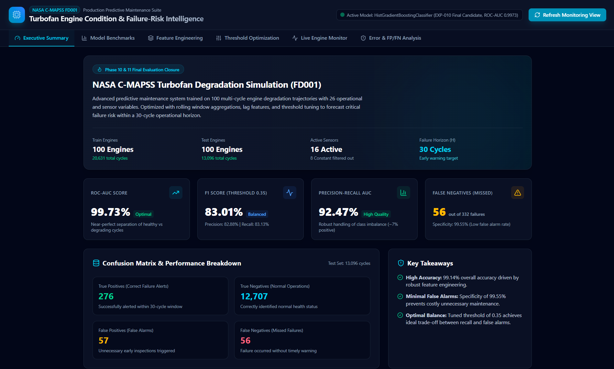
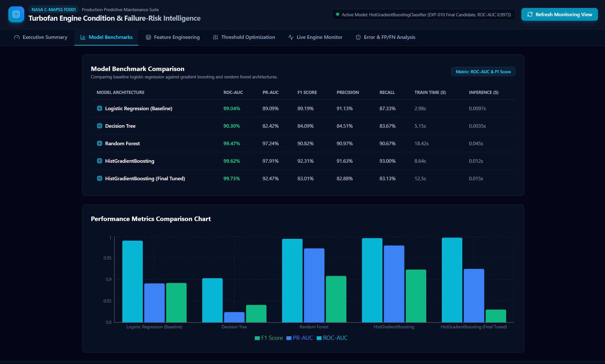
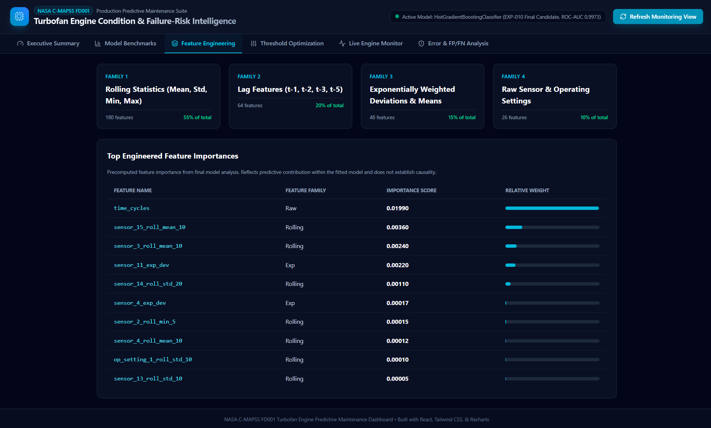
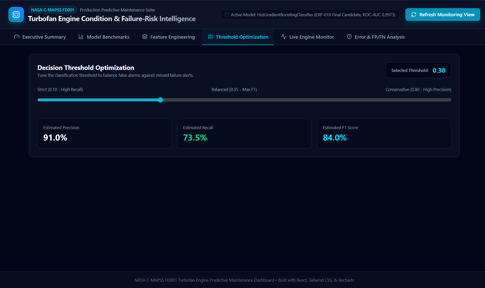
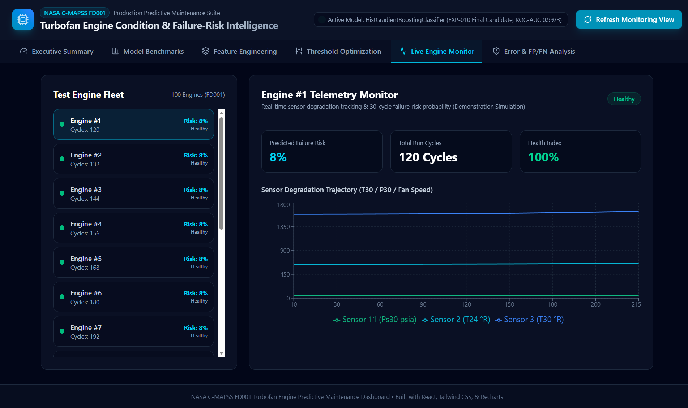

# Predictive Maintenance for Industrial Equipment

### NASA C-MAPSS FD001 Turbofan Engine Dataset

[]()
[]()
[]()
[]()

---

## Overview

This project develops an end-to-end predictive maintenance classification system designed to forecast equipment failure risk in industrial turbofan engines using the standardized **NASA C-MAPSS FD001** dataset. 

Rather than estimating continuous Remaining Useful Life (RUL), the system formulates the task as a binary classification problem: predicting whether an engine will experience a critical failure within the next **30 operational cycles** ($0 < \text{RUL} \le 30$).

---

## Key Results (Official Held-Out Test Set)

The final production model is a tuned **HistGradientBoostingClassifier** (`EXP-010-final-candidate`), evaluated on the official held-out test set consisting of **100 engines** and **13,096 total cycles**:

- **Production Threshold:** `0.35` (selected as a higher-recall operating point prioritizing fewer missed failures)
- **ROC-AUC:** `99.73%` ($0.997278$)
- **PR-AUC:** `92.47%` ($0.924737$)
- **F1 Score:** `83.01%` ($0.830075$)
- **Recall:** `83.13%` ($0.831325$)
- **Precision:** `82.88%` ($0.828828$)
- **Specificity:** `99.55%` ($0.995534$)
- **Accuracy:** `99.14%` ($0.991371$)

### Confusion Matrix (Test Set: 13,096 observations)
- **True Positives (TP):** 276 (Successfully detected failure-risk windows)
- **True Negatives (TN):** 12,707 (Correctly identified normal health status)
- **False Positives (FP):** 57 (Unnecessary early inspection alerts)
- **False Negatives (FN):** 56 (Missed failure windows)

| | Predicted Negative | Predicted Positive |
|---|---:|---:|
| **Actual Negative** | 12,707 | 57 |
| **Actual Positive** | 56 | 276 |

---

## Dataset

The **NASA C-MAPSS FD001** dataset simulates multi-cycle degradation trajectories under sea-level conditions with high-altitude operating settings:
- **Training Data:** 100 engines, 20,631 total cycles, running to complete failure.
- **Test Data:** 100 engines, 13,096 total cycles, truncated prior to failure.
- **Features:** 26 raw channels (2 identifiers, 3 operating settings, 21 sensor channels).
- **Constant Channels Filtered:** 8 invariant sensor/setting channels (`op_setting_2`, `op_setting_3`, `sensor_1`, `sensor_5`, `sensor_10`, `sensor_16`, `sensor_18`, `sensor_19`) were identified and excluded.

---

## Target Definition & Failure Horizon

The target variable $y(t)$ is defined as:
$$y(t) = 1 \quad \text{if} \quad 0 < \text{RUL}(t) \le 30$$
$$y(t) = 0 \quad \text{otherwise}$$

- **Boundary Conditions:**
  - $\text{RUL} = 30 \implies y = 1$ (inside horizon)
  - $\text{RUL} = 1 \implies y = 1$ (imminent failure)
  - $\text{RUL} = 0 \implies y = 0$ (exact failure point itself; future failure window has closed)
  - $\text{RUL} = 31 \implies y = 0$ (outside horizon)

---

## Methodology & Temporal Feature Engineering

To prevent temporal leakage and ensure causal integrity, feature engineering was performed strictly within engine unit boundaries:
1. **Operating Age:** Time cycles tracking cumulative runtime.
2. **Raw Informative Sensors:** 16 active sensor channels.
3. **Causal Lag Features:** Lags at $t-1, t-2, t-3, t-5$.
4. **Rolling Statistics:** Mean, std, min, max across windows ($5, 10, 20$ cycles).
5. **Exponentially Weighted Deviations:** Short- and long-term trend divergences.
6. **Expanding Lifetime Statistics:** Cumulative expanding mean and variance.

**Total Features:** `385 modeling columns`.

---

## Model Benchmark & Validation Performance

Models were trained on an 80-engine development split and evaluated on a held-out 20-engine validation split (with zero engine overlap):

| Experiment ID | Model Architecture | Validation ROC-AUC | Validation PR-AUC | Validation F1 | Validation Recall | Validation Precision | Train Time (s) |
| :--- | :--- | :---: | :---: | :---: | :---: | :---: | :---: |
| **EXP-001** | Logistic Regression (Baseline) | 99.04% | 89.09% | 89.19% | 87.33% | 91.13% | 2.98s |
| **EXP-003** | Decision Tree | 90.30% | 82.42% | 84.09% | 83.67% | 84.51% | 5.15s |
| **EXP-004** | Random Forest | 99.47% | 97.24% | 90.82% | 90.67% | 90.97% | 18.42s |
| **EXP-005** | HistGradientBoosting | 99.62% | 97.91% | 92.31% | 93.00% | 91.63% | 8.64s |

---

## Hyperparameter Tuning & Threshold Selection

- **Tuned Hyperparameters (`EXP-010`):** `learning_rate = 0.1`, `max_iter = 100`, `max_leaf_nodes = 31`, `min_samples_leaf = 10`, `l2_regularization = 1.0`.
- **Validation CV PR-AUC:** $0.966350$ across grouped cross-validation folds.

### Decision Threshold Trade-off
The production threshold of `0.35` was selected through leakage-safe out-of-fold (OOF) threshold analysis on development data:

| Metric | Threshold 0.50 (Default) | Threshold 0.35 (Production) |
| :--- | :---: | :---: |
| **Recall** | 92.50% | **94.33%** |
| **Precision** | 92.65% | 89.42% |
| **F1 Score** | 92.58% | 91.81% |
| **False Positives (FP)** | 44 | 67 |
| **False Negatives (FN)** | 45 | **34** |

> **Threshold Rationale:** The 0.35 production threshold was selected through leakage-safe OOF threshold analysis as a higher-recall operating point, reducing missed failures (from 45 down to 34 on development data) at the cost of additional false alarms and lower precision/F1.

---

## Final Official Test Evaluation (`EXP-010-final-candidate`)

After freezing the tuned architecture and the 0.35 threshold, the final candidate was retrained on all 100 development engines and evaluated once on the isolated official test set (100 engines, 13,096 cycles):

| Metric | Held-Out Test Score |
| :--- | :---: |
| **ROC-AUC** | 99.73% ($0.997278$) |
| **PR-AUC** | 92.47% ($0.924737$) |
| **Recall** | 83.13% ($0.831325$) |
| **Precision** | 82.88% ($0.828828$) |
| **F1 Score** | 83.01% ($0.830075$) |
| **Specificity** | 99.55% ($0.995534$) |
| **Accuracy** | 99.14% ($0.991371$) |

---

## Application & Model Evidence

The following visual artifacts illustrate the completed predictive maintenance system, model performance, feature engineering, threshold analysis, and demonstration monitoring interface.

### Executive Summary


### Model Benchmark Comparison


### Feature Engineering & Model Analysis


### Threshold Optimization


### Demonstration Engine Monitoring


*(Note: The Live Engine Monitor displays demonstration/simulated monitoring data and does not represent live industrial telemetry.)*

---

## Monitoring Application

A React / Vite / Tailwind CSS monitoring dashboard provides:
- **Executive Summary & KPI Cards:** Overview of final test metrics and confusion matrix breakdown.
- **Model Benchmarks:** Comparative performance tables and charts across baseline and gradient boosting models.
- **Feature Engineering Breakdown:** Precomputed feature importance from final model analysis. Reflects predictive contribution within the fitted model and does not establish causality.
- **Threshold Optimization Explorer:** Interactive classification threshold tuning (production threshold = 0.35).
- **Live Fleet & Engine Monitor:** Trajectory telemetry curves (Sensor 2, Sensor 3, Sensor 11) and 30-cycle failure-risk probability context for all 100 test engines (demonstration simulation).
- **Error Analysis Deep Dive:** Detailed analysis of false positives (57) and false negatives (56).

---

## Testing & Quality Assurance

The project includes an automated test suite covering data loading, target boundaries, feature extraction, leakage prevention, model serialization, and dashboard metric provenance.

To run the test suite:
```bash
PYTHONPATH=. pytest -v
```
*(Result: 31 passed, 0 failed)*

---

## Reproducibility & Setup

### 1. Clone & Environment Setup
```bash
git clone https://github.com/theOnlyIngeniousAnurag/predictive_maintenance_for_industrial_equipment.git
cd predictive_maintenance_for_industrial_equipment

python -m venv .venv
source .venv/bin/activate  # On Windows: .venv\Scripts\activate
pip install -r requirements.txt
```

### 2. Run Test Suite
```bash
PYTHONPATH=. pytest -v
```

### 3. Frontend Development & Build
```bash
npm install
npm run build
npx tsc --noEmit
```

---

## Limitations

1. **Simulated Benchmark:** NASA C-MAPSS FD001 is a simulated turbofan degradation benchmark and does not replace physical industrial turbine telemetry.
2. **Binary Framing:** The model classifies 30-cycle failure risk and does not output continuous Remaining Useful Life (RUL) regression estimates.
3. **Attribution vs Causality:** Feature importance indicates predictive model contribution within the fitted model and does not establish physical root cause.

---

## License & References

- **Dataset:** NASA Commercial Modular Aero-Propulsion System Simulation (C-MAPSS) FD001.
- **License:** Open source license pending project-owner decision (provided for academic and internship capstone evaluation).
